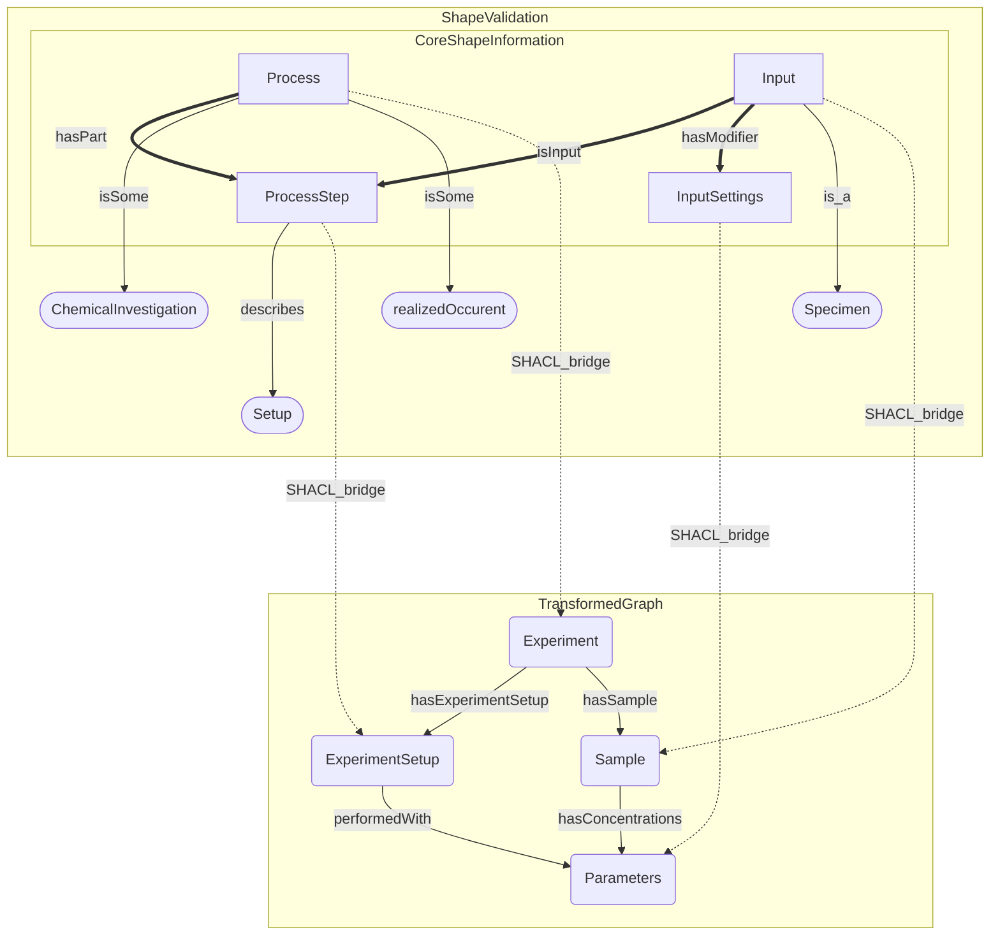

# Example: Process → Experiment

This example maps instance data conforming to a
**Process/ProcessStep/Input/InputSettings** design pattern to an
**Experiment/ExperimentSetup/Sample/Parameters** design pattern.

## The mapping



Node shapes: **rectangle** = core source class (bridged), **stadium** = peripheral source class (validation-only), **rounded rectangle** = target class.

## Running the example

```bash
just example
# or directly:
python examples/process_to_experiment/run_example.py
```

Or step by step via the CLI:

```bash
# 1. Validate the mapping
shacl-bridges validate examples/process_to_experiment/mapping/bridge.yaml

# 2. Inspect the generated diagram
shacl-bridges diagram examples/process_to_experiment/mapping/bridge.yaml

# 3. Generate the SHACL shape
shacl-bridges generate examples/process_to_experiment/mapping/bridge.yaml \
  -o examples/process_to_experiment/bridge_shape.ttl

# 4. Run the bridge on the test data
shacl-bridges run \
  examples/process_to_experiment/mapping/bridge.yaml \
  tests/test_data/data.ttl \
  --expanded examples/process_to_experiment/expanded.ttl \
  --diff     examples/process_to_experiment/diff.ttl
```

Expected output:

```
Data conforms to source pattern.
Bridge added N new triple(s).
Written: examples/process_to_experiment/expanded.ttl
Written: examples/process_to_experiment/diff.ttl
```

## The mapping file

The full mapping lives in `examples/process_to_experiment/mapping/bridge.yaml`:

```yaml
--8<-- "examples/process_to_experiment/mapping/bridge.yaml"
```

## What the generated SHACL looks like

The tool generates a shape targeting `ex:Process` (the declared root):

```turtle
shapes:BridgeShape
    a sh:NodeShape ;
    sh:targetClass ex:Process ;
    sh:property [
        sh:path ex:hasPart ;
        sh:node [ a sh:NodeShape ; sh:class ex:ProcessStep ; ... ] ;
    ] ;
    sh:rule [
        a sh:SPARQLRule ;
        sh:construct """
            CONSTRUCT {
              ?this rdf:type ex:Experiment .
              ?this ex:hasExperimentSetup ?var_b .
              ...
            }
            WHERE {
              ?this rdf:type ex:Process .
              ?this ex:hasPart ?var_b .
              ?var_b rdf:type ex:ProcessStep .
              ...
            }
        """ ;
    ] ;
.
```

## Reading the diff output

The diff graph (`diff.ttl`) contains only the triples introduced by the bridge —
nothing that was already in the source graph or derivable from RDFS inference.
This makes it easy to verify exactly what the bridge produced.
