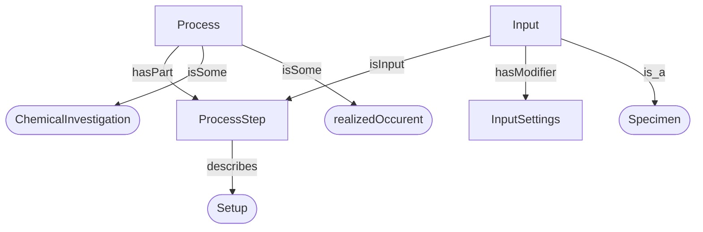
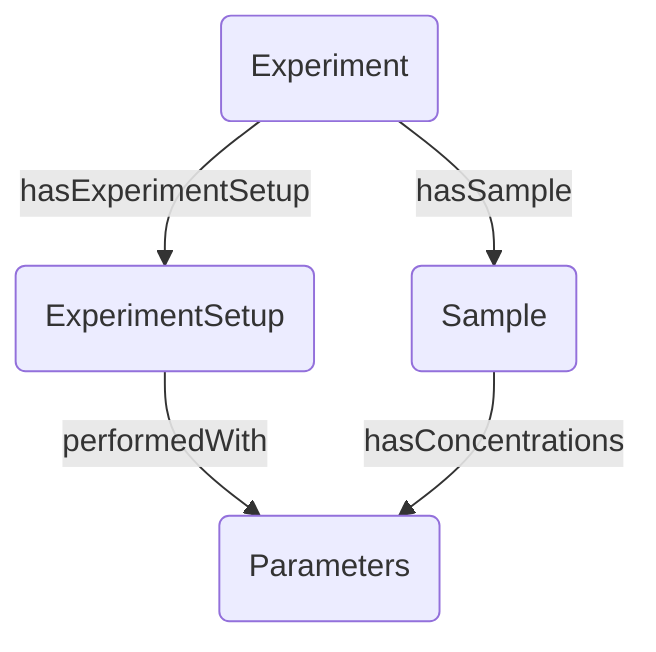

# Example: Process → Experiment

This example maps instance data conforming to a **Process/ProcessStep/Input/InputSettings** design pattern to an **Experiment/ExperimentSetup/Sample/Parameters** design pattern.

## Source pattern



## Target pattern



## Running the example

```bash
just example
# or directly:
python examples/process_to_experiment/run_example.py
```

Expected output:
```
Loading mapping…
  Root class: ex:Process
  Connectivity check passed.
Generating SHACL shape…
  Written: examples/process_to_experiment/bridge_shape.ttl
Running bridge…
  Conforms: True
  Written: examples/process_to_experiment/expanded.ttl
  Written: examples/process_to_experiment/diff.ttl
Generating Mermaid diagram…
  Written: examples/process_to_experiment/diagram.mmd
Done. Bridge added N new triples.
```

## Mapping files

The four CSVs live in `examples/process_to_experiment/mapping/`.

=== "prefixes.csv"
    ```csv
    --8<-- "examples/process_to_experiment/mapping/prefixes.csv"
    ```

=== "shape_validation.csv"
    ```csv
    --8<-- "examples/process_to_experiment/mapping/shape_validation.csv"
    ```

=== "shape_bridge.csv"
    ```csv
    --8<-- "examples/process_to_experiment/mapping/shape_bridge.csv"
    ```

## What the generated SHACL looks like

The tool generates a shape targeting `ex:Process` (the marked root):

```turtle
:BridgeShape
    a sh:NodeShape ;
    sh:targetClass ex:Process ;
    sh:property [
        sh:path ex:hasPart ;
        sh:node [ a sh:NodeShape ; sh:class ex:ProcessStep ; ... ] ;
    ] ;
    sh:rule [
        a sh:SPARQLRule ;
        sh:construct """
            CONSTRUCT {
              ?this rdf:type ex:Experiment .
              ?this ex:hasExperimentSetup ?var_b .
              ...
            }
            WHERE {
              ?this rdf:type ex:Process .
              ?this ex:hasPart ?var_b .
              ...
            }
        """ ;
    ] ;
.
```
