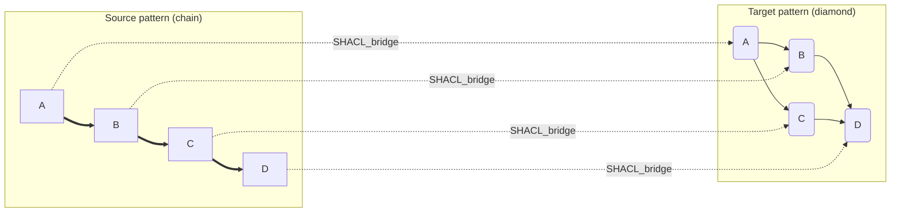
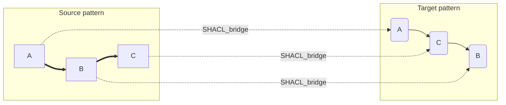
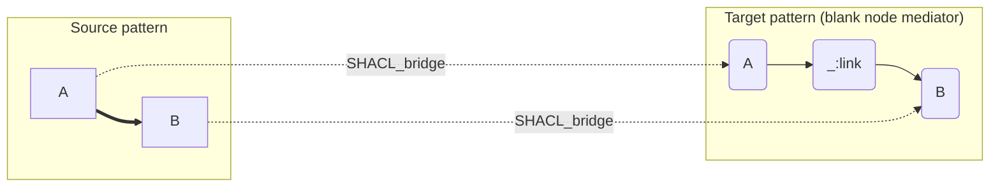
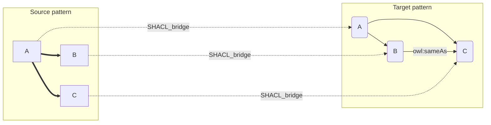
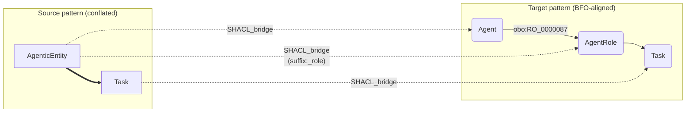

# Common Design Pattern Conversions

This page shows how to translate four common structural transformations using SHACL Bridges.
Each example provides:

1. A **Mermaid diagram** visualising the before/after graph shapes
2. A **bridge YAML** file
3. A minimal **source RDF** data file
4. The **SPARQL CONSTRUCT** query that is embedded in the generated SHACL shape
5. The **diff output** — the triples the bridge adds

---

## Pattern 1 — Chain → Diamond

**Chain**: `A → B → C → D` (a single linear path)
**Diamond**: `A → B`, `A → C`, `B → D`, `C → D` (two parallel branches converging)

This is the classic "split-and-merge" transformation: one linear dependency chain is
replaced by two independent sub-processes that both feed into the same final node.



### bridge.yaml

```yaml
metadata:
  title: "Chain to Diamond"
  mapping_justification: "semapv:ManualMappingCuration"

prefixes:
  ex: "http://example.org/pattern1#"

source_pattern:
  root: "ex:A"
  triples:
    - ["ex:A", "ex:next", "ex:B"]
    - ["ex:B", "ex:next", "ex:C"]
    - ["ex:C", "ex:next", "ex:D"]

target_pattern:
  triples:
    - ["ex:A", "ex:branchLeft",  "ex:B"]
    - ["ex:A", "ex:branchRight", "ex:C"]
    - ["ex:B", "ex:feeds",       "ex:D"]
    - ["ex:C", "ex:feeds",       "ex:D"]

class_map:
  - source: "ex:A"
    target: "ex:A"
    justification: "semapv:ManualMappingCuration"
    comment: "Root node, same class in target"
  - source: "ex:B"
    target: "ex:B"
    justification: "semapv:ManualMappingCuration"
  - source: "ex:C"
    target: "ex:C"
    justification: "semapv:ManualMappingCuration"
  - source: "ex:D"
    target: "ex:D"
    justification: "semapv:ManualMappingCuration"
    comment: "Terminal node — receives two incoming edges in target"
```

### data.ttl (source instances)

```turtle
@prefix ex: <http://example.org/pattern1#> .
@prefix rdf: <http://www.w3.org/1999/02/22-rdf-syntax-ns#> .

ex:a1 a ex:A .
ex:b1 a ex:B .
ex:c1 a ex:C .
ex:d1 a ex:D .

ex:a1 ex:next ex:b1 .
ex:b1 ex:next ex:c1 .
ex:c1 ex:next ex:d1 .
```

### Generated SPARQL CONSTRUCT (embedded in SHACL)

```sparql
CONSTRUCT {
  ?this    rdf:type ex:A .
  ?var_b   rdf:type ex:B .
  ?var_c   rdf:type ex:C .
  ?var_d   rdf:type ex:D .
  ?this    ex:branchLeft  ?var_b .
  ?this    ex:branchRight ?var_c .
  ?var_b   ex:feeds       ?var_d .
  ?var_c   ex:feeds       ?var_d .
}
WHERE {
  ?this  rdf:type ex:A .
  ?this  ex:next  ?var_b .
  ?var_b rdf:type ex:B .
  ?var_b ex:next  ?var_c .
  ?var_c rdf:type ex:C .
  ?var_c ex:next  ?var_d .
  ?var_d rdf:type ex:D .
}
```

### diff.ttl (bridge output — new triples only)

```turtle
@prefix ex: <http://example.org/pattern1#> .
@prefix rdf: <http://www.w3.org/1999/02/22-rdf-syntax-ns#> .

ex:a1 ex:branchLeft  ex:b1 .
ex:a1 ex:branchRight ex:c1 .
ex:b1 ex:feeds       ex:d1 .
ex:c1 ex:feeds       ex:d1 .
```

!!! note
    The `rdf:type` triples are already present in the source graph (asserted or inferred
    by RDFS), so they do **not** appear in the diff. Only the newly constructed relation
    triples are added.

---

## Pattern 2 — Hierarchy Rearrangement

**Before**: `A → B → C` (B is a child of A, C is a grandchild)
**After**: `A → C → B` (C is promoted one level; B becomes a child of C)

Use this when a target ontology has a different containment / specialisation hierarchy
than the source.



### bridge.yaml

```yaml
metadata:
  title: "Hierarchy Rearrangement"
  mapping_justification: "semapv:ManualMappingCuration"

prefixes:
  ex: "http://example.org/pattern2#"

source_pattern:
  root: "ex:A"
  triples:
    - ["ex:A", "ex:contains", "ex:B"]
    - ["ex:B", "ex:contains", "ex:C"]

target_pattern:
  triples:
    - ["ex:A", "ex:contains", "ex:C"]
    - ["ex:C", "ex:contains", "ex:B"]

class_map:
  - source: "ex:A"
    target: "ex:A"
    justification: "semapv:ManualMappingCuration"
  - source: "ex:B"
    target: "ex:B"
    justification: "semapv:ManualMappingCuration"
    comment: "B is demoted one level — becomes a child of C in the target"
  - source: "ex:C"
    target: "ex:C"
    justification: "semapv:ManualMappingCuration"
    comment: "C is promoted — becomes a direct child of A in the target"
```

### data.ttl (source instances)

```turtle
@prefix ex: <http://example.org/pattern2#> .

ex:a1 a ex:A .
ex:b1 a ex:B .
ex:c1 a ex:C .

ex:a1 ex:contains ex:b1 .
ex:b1 ex:contains ex:c1 .
```

### Generated SPARQL CONSTRUCT

```sparql
CONSTRUCT {
  ?this    rdf:type ex:A .
  ?var_b   rdf:type ex:B .
  ?var_c   rdf:type ex:C .
  ?this    ex:contains ?var_c .
  ?var_c   ex:contains ?var_b .
}
WHERE {
  ?this  rdf:type    ex:A .
  ?this  ex:contains ?var_b .
  ?var_b rdf:type    ex:B .
  ?var_b ex:contains ?var_c .
  ?var_c rdf:type    ex:C .
}
```

### diff.ttl

```turtle
@prefix ex: <http://example.org/pattern2#> .

ex:a1 ex:contains ex:c1 .
ex:c1 ex:contains ex:b1 .
```

---

## Pattern 3 — Blank Node Insertion

Sometimes the target pattern requires an **intermediate node** that has no equivalent in
the source — for example, a reified relation or an anonymous grouping node.
SHACL Bridges uses the `_:label` syntax for blank nodes: one fresh blank node is created
per solution row, so each matched source subgraph gets its own intermediate instance.



!!! info "Blank node semantics in SPARQL CONSTRUCT"
    In a SPARQL CONSTRUCT template, a blank-node label such as `_:link` generates a
    **new, distinct** blank node for every solution row. This is the standard mechanism
    for creating anonymous intermediary nodes during graph transformation.

### bridge.yaml

```yaml
metadata:
  title: "Blank Node Insertion"
  mapping_justification: "semapv:ManualMappingCuration"

prefixes:
  ex: "http://example.org/pattern3#"

source_pattern:
  root: "ex:A"
  triples:
    - ["ex:A", "ex:relatesTo", "ex:B"]

target_pattern:
  triples:
    - ["ex:A",    "ex:hasLink", "_:link"]
    - ["_:link",  "ex:linksTo", "ex:B"]

class_map:
  - source: "ex:A"
    target: "ex:A"
    justification: "semapv:ManualMappingCuration"
  - source: "ex:B"
    target: "ex:B"
    justification: "semapv:ManualMappingCuration"
    comment: "Blank node _:link is an anonymous mediator with no source equivalent"
```

!!! tip
    Blank-node targets in `class_map` are **not** supported and not needed — the blank
    node appears only in `target_pattern.triples`, not as a `class_map` target.

### data.ttl (source instances)

```turtle
@prefix ex: <http://example.org/pattern3#> .

ex:a1 a ex:A .
ex:b1 a ex:B .
ex:a1 ex:relatesTo ex:b1 .

ex:a2 a ex:A .
ex:b2 a ex:B .
ex:a2 ex:relatesTo ex:b2 .
```

### Generated SPARQL CONSTRUCT

```sparql
CONSTRUCT {
  ?this   rdf:type ex:A .
  ?var_b  rdf:type ex:B .
  ?this   ex:hasLink _:link .
  _:link  ex:linksTo ?var_b .
}
WHERE {
  ?this  rdf:type    ex:A .
  ?this  ex:relatesTo ?var_b .
  ?var_b rdf:type    ex:B .
}
```

### diff.ttl

```turtle
@prefix ex: <http://example.org/pattern3#> .

ex:a1  ex:hasLink _:bn0 .
_:bn0  ex:linksTo ex:b1 .

ex:a2  ex:hasLink _:bn1 .
_:bn1  ex:linksTo ex:b2 .
```

Each source pair `(a1, b1)` and `(a2, b2)` produces its own distinct blank node
(`_:bn0`, `_:bn1`). The blank node labels in the diff file are assigned by the RDF
serialiser and are not meaningful beyond the file they appear in.

---

## Pattern 4 — Instance Convergence via `owl:sameAs`

When two source classes represent the same real-world entity and you want the target
graph to reflect that identity, you assert `owl:sameAs` between the corresponding
target instances.  An OWL reasoner will then merge all properties across the two
identity-linked nodes.



!!! info "When to use `owl:sameAs`"
    Use this pattern when B and C are separate individuals in the source that are
    determined to be the same entity (e.g. through an external identifier or a
    domain rule). The `owl:sameAs` assertion lets an OWL reasoner propagate all
    properties of B to C and vice versa, effectively converging them into one node.

### bridge.yaml

```yaml
metadata:
  title: "Instance Convergence via owl:sameAs"
  mapping_justification: "semapv:ManualMappingCuration"

prefixes:
  ex:  "http://example.org/pattern4#"
  owl: "http://www.w3.org/2002/07/owl#"

source_pattern:
  root: "ex:A"
  triples:
    - ["ex:A", "ex:hasLeft",  "ex:B"]
    - ["ex:A", "ex:hasRight", "ex:C"]

target_pattern:
  triples:
    - ["ex:A", "ex:hasLeft",  "ex:B"]
    - ["ex:A", "ex:hasRight", "ex:C"]
    - ["ex:B", "owl:sameAs",  "ex:C"]

class_map:
  - source: "ex:A"
    target: "ex:A"
    justification: "semapv:ManualMappingCuration"
  - source: "ex:B"
    target: "ex:B"
    justification: "semapv:ManualMappingCuration"
    comment: "Asserted to be the same entity as C in the target"
  - source: "ex:C"
    target: "ex:C"
    justification: "semapv:ManualMappingCuration"
```

### data.ttl (source instances)

```turtle
@prefix ex:  <http://example.org/pattern4#> .
@prefix owl: <http://www.w3.org/2002/07/owl#> .

ex:a1 a ex:A .
ex:b1 a ex:B .
ex:c1 a ex:C .

ex:a1 ex:hasLeft  ex:b1 .
ex:a1 ex:hasRight ex:c1 .
```

### Generated SPARQL CONSTRUCT

```sparql
CONSTRUCT {
  ?this   rdf:type ex:A .
  ?var_b  rdf:type ex:B .
  ?var_c  rdf:type ex:C .
  ?this   ex:hasLeft  ?var_b .
  ?this   ex:hasRight ?var_c .
  ?var_b  owl:sameAs  ?var_c .
}
WHERE {
  ?this  rdf:type    ex:A .
  ?this  ex:hasLeft  ?var_b .
  ?var_b rdf:type    ex:B .
  ?this  ex:hasRight ?var_c .
  ?var_c rdf:type    ex:C .
}
```

### diff.ttl

```turtle
@prefix ex:  <http://example.org/pattern4#> .
@prefix owl: <http://www.w3.org/2002/07/owl#> .

ex:b1 owl:sameAs ex:c1 .
```

The relation triples (`ex:hasLeft`, `ex:hasRight`) were already present in the source
data, so only the `owl:sameAs` assertion is new.

!!! warning "Downstream reasoner required"
    The `owl:sameAs` triple alone does not merge the nodes in the diff graph.
    You need an OWL reasoner (e.g. `owlrl`) applied to `expanded.ttl` to derive
    all entailments. Pass `--inference owlrl` to `shacl-bridges run` to enable this.

---

## Pattern 5 — Instance Split (Conflated Entity → BFO Entity + Role)

Some source ontologies conflate an entity and its role into a single class —
a common pattern when modelling agents: one class represents both the
*independent continuant* (the agent itself) and the *role* it plays.
BFO / OBI requires these to be separate individuals linked by
`obo:RO_0000087` (*bearer of*).

The **instance split** transform mints a fresh IRI for the role instance
at query time using SPARQL's `BIND(IRI(CONCAT(...)))` mechanism.
The minted IRI is deterministic (suffix appended to the source IRI), so
running the bridge twice produces no duplicates.



!!! info "IRI minting — `suffix:` form"
    `derived_iri: "suffix:_role"` appends the literal string `_role` to the
    source instance IRI.  So `ex:researcherSmith` becomes
    `ex:researcherSmith_role`.  The generated SPARQL is:

    ```sparql
    BIND(IRI(CONCAT(STR(?this), "_role")) AS ?derived_AgentRole)
    ```

    This is evaluated once per matched `?this`, guaranteeing a 1-to-1
    correspondence between source instances and minted role instances.

### bridge.yaml

```yaml
metadata:
  title: "Agentic Entity Split (BFO-aligned)"
  mapping_justification: "semapv:ManualMappingCuration"

prefixes:
  ex:  "http://example.org/pattern5#"
  obo: "http://purl.obolibrary.org/obo/"

source_pattern:
  root: "ex:AgenticEntity"
  triples:
    - ["ex:AgenticEntity", "ex:performsTask", "ex:Task"]

target_pattern:
  triples:
    - ["ex:Agent",     "obo:RO_0000087",  "ex:AgentRole"]
    - ["ex:AgentRole", "ex:performsTask",  "ex:Task"]

class_map:
  # Regular (non-derived) entry — source instance keeps its IRI, becomes Agent
  - source: "ex:AgenticEntity"
    target: "ex:Agent"
    justification: "semapv:ManualMappingCuration"
    comment: "Entity side — retains the source instance IRI"

  # Derived entry — a new AgentRole instance is minted as {source_iri}_role
  - source: "ex:AgenticEntity"
    target: "ex:AgentRole"
    derived_iri: "suffix:_role"
    justification: "semapv:ManualMappingCuration"
    comment: "Role side — IRI minted as {source_iri}_role"

  - source: "ex:Task"
    target: "ex:Task"
    justification: "semapv:ManualMappingCuration"
```

!!! tip "Two entries, same source"
    It is valid — and necessary for a split — to have **two `class_map` entries
    with the same `source`**.  The first (no `derived_iri`) is the *primary*
    mapping that determines `?this`'s target type.  The second (with
    `derived_iri`) describes the newly minted sibling instance.

### data.ttl (source instances)

```turtle
@prefix ex: <http://example.org/pattern5#> .

ex:researcherSmith a ex:AgenticEntity .
ex:taskA           a ex:Task .
ex:researcherSmith ex:performsTask ex:taskA .

ex:robotArm1  a ex:AgenticEntity .
ex:taskB      a ex:Task .
ex:robotArm1  ex:performsTask ex:taskB .
```

### Generated SPARQL CONSTRUCT

```sparql
CONSTRUCT {
  ?this               rdf:type ex:Agent .
  ?derived_AgentRole  rdf:type ex:AgentRole .
  ?var_b              rdf:type ex:Task .
  ?this               obo:RO_0000087  ?derived_AgentRole .
  ?derived_AgentRole  ex:performsTask ?var_b .
}
WHERE {
  ?this  rdf:type       ex:AgenticEntity .
  ?this  ex:performsTask ?var_b .
  ?var_b rdf:type       ex:Task .
  BIND(IRI(CONCAT(STR(?this), "_role")) AS ?derived_AgentRole)
}
```

### diff.ttl

```turtle
@prefix ex:  <http://example.org/pattern5#> .
@prefix obo: <http://purl.obolibrary.org/obo/> .
@prefix rdf: <http://www.w3.org/1999/02/22-rdf-syntax-ns#> .

# --- researcherSmith split ---
ex:researcherSmith      rdf:type ex:Agent .
ex:researcherSmith_role rdf:type ex:AgentRole .
ex:researcherSmith      obo:RO_0000087  ex:researcherSmith_role .
ex:researcherSmith_role ex:performsTask ex:taskA .

# --- robotArm1 split ---
ex:robotArm1      rdf:type ex:Agent .
ex:robotArm1_role rdf:type ex:AgentRole .
ex:robotArm1      obo:RO_0000087  ex:robotArm1_role .
ex:robotArm1_role ex:performsTask ex:taskB .
```

Each source `AgenticEntity` instance produces exactly one minted `AgentRole`
instance.  The `rdf:type ex:Task` triples are not new (already in the source
graph), so they do not appear in the diff.

!!! warning "IRI stability"
    The suffix strategy works well when source IRIs are stable.  If source IRIs
    are regenerated across runs (e.g. UUIDs assigned at ingest time), consider
    minting role IRIs from a stable identifier embedded in a data property
    rather than from the instance IRI itself.

---

## Combining Patterns

These five building blocks can be composed:

- A **chain → diamond** followed by a **blank node** insertion on one branch.
- A **hierarchy rearrangement** that also introduces a **sameAs** convergence at the
  bottom level.
- An **instance split** whose minted role node also carries a **blank node** mediator
  to a third class.

In all cases the approach is the same: enumerate the full `source_pattern` and
`target_pattern` as S-P-O triples, provide the class alignment in `class_map`,
and add `derived_iri` entries wherever a new instance must be minted.
The tool handles variable assignment and SPARQL generation automatically.
